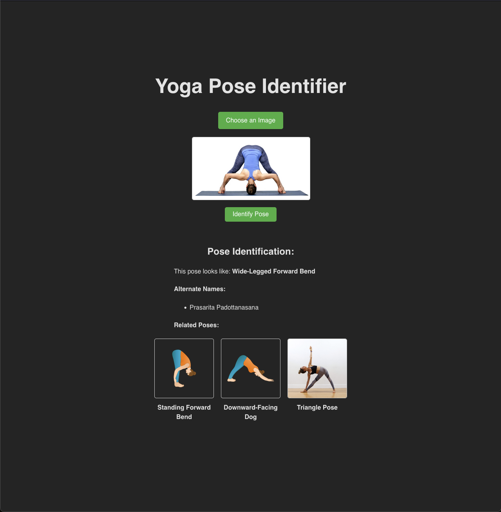

# Yoga App 

Side project to experiment with genai and create something that can help with yoga teachers crafting their practice. 


## Features
1. The user uploads an image of a yoga pose 
1. The backend calls the LLM to ask what the image looks like and what related poses might be 
1. The name of the pose and alternate names are displayed 
1. Additional related poses are shown and images displayed 

## Frontend 
Created with React Vite


## Backend 
Python backend that it structured to allow for a langchain backend but currently is using native gemini calls. 
GenAI calls are using the free tier of Googles AI Studio
Images fetched using Programmable search engine - https://programmablesearchengine.google.com/


## Running 
`docker compose up`

### ENVs 
```
# Backend
GEMINI_API_KEY=""
LOGGING_LEVEL="DEBUG"
SEARCH_ENGINE_CX=""
SEARCH_ENGINE_URL = ""
SEARCH_ENGINE_API_KEY=""


# Frontend 
BACKEND_URL="http://localhost:8085"
```


### Screenshots 
 


## TODO 
* Edit prompt to respond to picutres that are not yoga poses 
* Create way for users to provide feedback 
* Change color scheme 
* Quick deploy scripts / CICD 
* Unit testing 